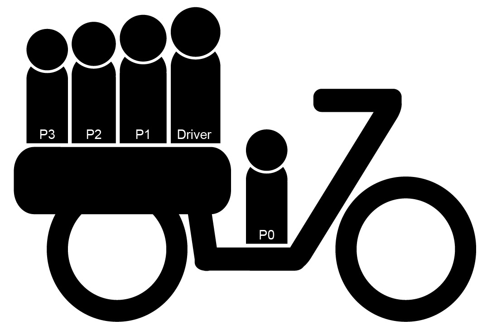

# NoHelmetNet
Proyecto materia Vision por Computación que hace claisificacion de imagenes utilizando YoloV8

## Clases y Encoding
El modelo consta de detección de 36 clases, en función de renocer cuantos pasasjeros lleva la moto, así como si llevan casco o no:

| Label Description                                | Class ID |
|--------------------------------------------------|----------|
| DNoHelmetP1NoHelmet                              | 0        |
| DHelmetP1Helmet                                  | 1        |
| DHelmet                                          | 2        |
| DNoHelmet                                        | 3        |
| DHelmetP1NoHelmet                                | 4        |
| DHelmetP0NoHelmetP1NoHelmet                      | 5        |
| DHelmetP1NoHelmetP2NoHelmet                      | 6        |
| DNoHelmetP1NoHelmetP2NoHelmet                    | 7        |
| DHelmetP1NoHelmetP2Helmet                        | 8        |
| DNoHelmetP1Helmet                                | 9        |
| DHelmetP0NoHelmetP1NoHelmetP2Helmet              | 10       |
| DNoHelmetP0NoHelmetP1NoHelmet                    | 11       |
| DNoHelmetP0NoHelmet                              | 12       |
| DHelmetP0NoHelmet                                | 13       |
| DNoHelmetP1HelmetP2Helmet                        | 14       |
| DHelmetP1HelmetP2Helmet                          | 15       |
| DNoHelmetP0NoHelmetP1NoHelmetP2NoHelmet          | 16       |
| DHelmetP0NoHelmetP1NoHelmetP2NoHelmet            | 17       |
| DHelmetP0NoHelmetP1Helmet                        | 18       |
| DHelmetP1HelmetP2NoHelmet                        | 19       |
| DNoHelmetP1NoHelmetP2NoHelmetP3NoHelmet          | 20       |
| DHelmetP0Helmet                                  | 21       |
| DNoHelmetP1NoHelmetP2Helmet                      | 22       |
| DHelmetP0NoHelmetP1HelmetP2Helmet                | 23       |
| DHelmetP1NoHelmetP2NoHelmetP3Helmet              | 24       |
| DHelmetP0HelmetP1Helmet                          | 25       |
| DNoHelmetP0NoHelmetP1Helmet                      | 26       |
| DHelmetP1NoHelmetP2NoHelmetP3NoHelmet            | 27       |
| DNoHelmetP0NoHelmetP1NoHelmetP2NoHelmetP3NoHelmet| 28       |
| DHelmetP0HelmetP1NoHelmetP2Helmet                | 29       |
| DHelmetP0HelmetP1NoHelmetP2NoHelmet              | 30       |
| DNoHelmetP0HelmetP1NoHelmet                      | 31       |
| DHelmetP0HelmetP1HelmetP2Helmet                  | 32       |
| DHelmetP0NoHelmetP1NoHelmetP2NoHelmetP3Helmet    | 33       |
| DNoHelmetP0NoHelmetP1NoHelmetP2Helmet            | 34       |
| DHelmetP0NoHelmetP1NoHelmetP2NoHelmetP3NoHelmet  | 35       |

De acuerdo a está codificación de labels:

